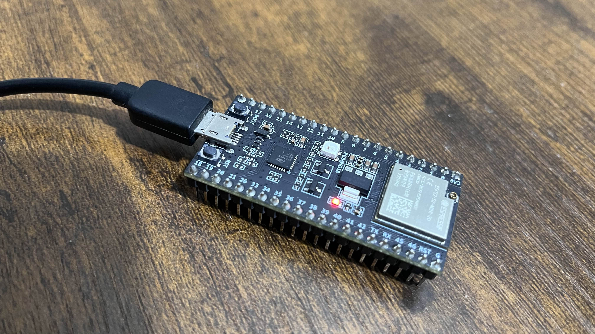
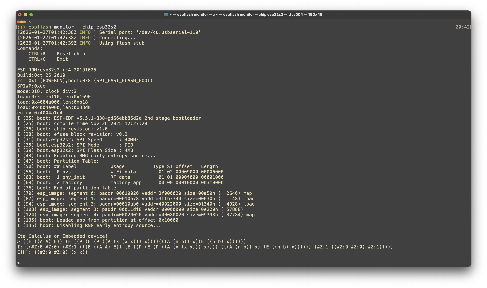
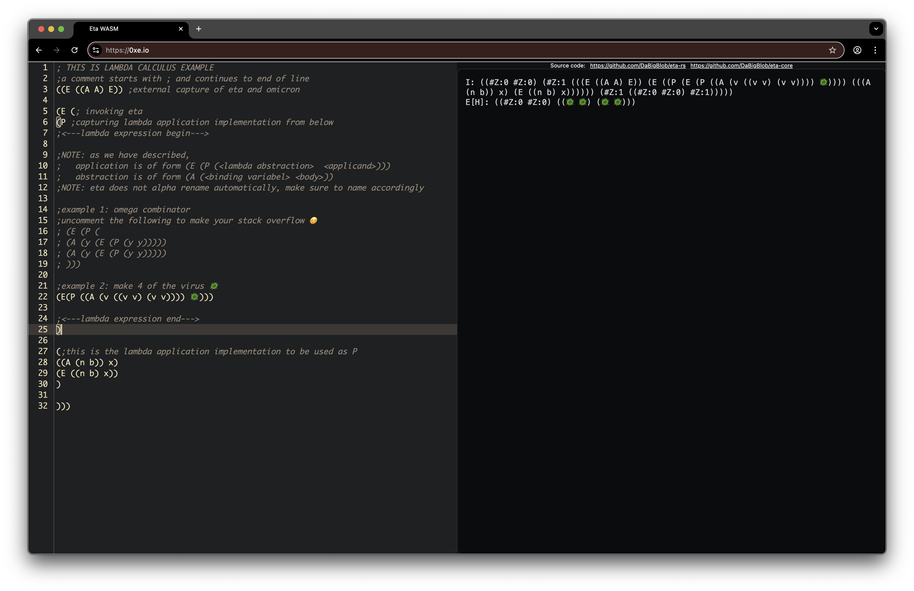
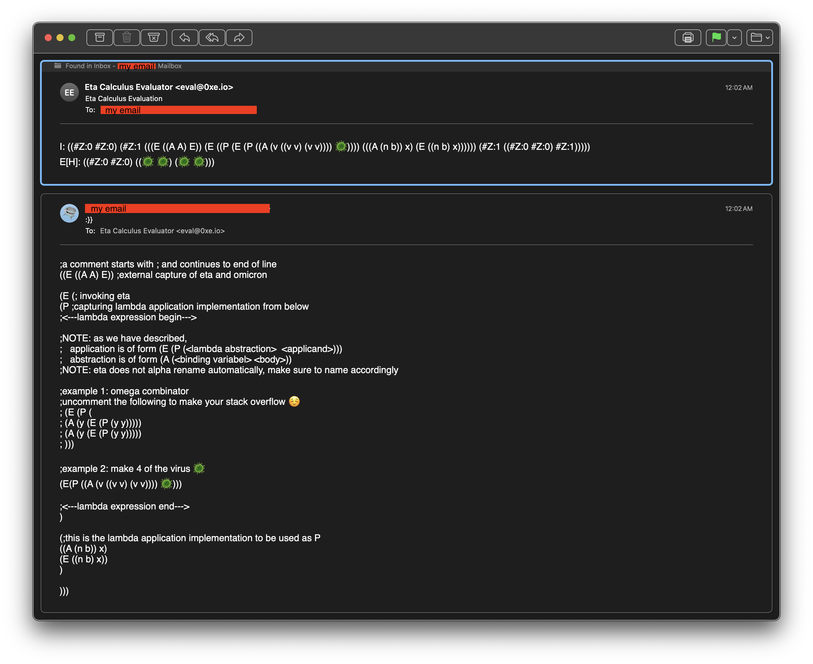

# Platform specific Human-Interfaces for Eta-Core
Run [Eta](https://github.com/DaBigBlob/eta-core) everywhere.

# Syntax/Semantics TLDR
Please see [Eta Core README](https://github.com/DaBigBlob/eta-core?tab=readme-ov-file#eta-core-no_std) for more information on Eta.
- **`S-Pair`**: Every program is a `S-Pair` i.e. an `S-expression` with exactly two members. This just the default surface syntax and is completely separate from the actual (AST) evaluator, and hence cna be pretty trivially changed.
- **Keywords**: There are no keywords in this programming language!
- **Metacircularity**: The Eta evaluator is also just a program of the Eta language.
- **Fundamental Axioms/primitives**: The Eta language has 2 axioms (i.e. inhabitants of the lowest Type universe):
    - The (existence of) evaluator itself (called Eta).
    - The trivial O(1) computation/evaluation (called Omicron).

# CLI [native]
### Usage
```
CLI for the Eta calculus

Usage: eta [OPTIONS] [S-PAIR]

Arguments:
  [S-PAIR]  Literal S-pair input (unless --file is used)

Options:
  -f, --file <PATH>  Treat INPUT as a path to a file and read the S-pair from it
  -h, --help         Print help (see more with '--help')
  -V, --version      Print version
```

### Installation
```bash
cargo install eta-cli
```
> Note: Binary releases will be available later.

### Build
```bash
cargo build -p eta-cli --release
```
ℹ️ **Note**: `--target` may be specified for crosscompilation.

# Embedded devices [native]
Code under `crates/embedded` is very specific to the `esp32-s2` chip (because thats what I had laying around).\
ℹ️ **Note**: It is extremely trivial to port to other embedded devices because of the extremely freestanding nature of the Eta interpreter.



### Running
```bash
cd crates/embedded
cargo run --release
```

# Web Browser [WASM]
### Use at https://0xE.io
Works completely offline!

> **TODO**: Switch from `lisp-mode` to custom `eta-mode` for highlighting code.

### Build
```
cargo build -p eta-wasm --target wasm32-unknown-unknown --release
```

### Deploy
```bash
make -C crates/wasm deploy-web # this auto builds first then deploys to cf workers
```

# Email Server
### Email Eta-expression to [eval@0xE.io](mailto:eval@0xE.io) to get it evaluated!

⚠️ **Note**: The reply may be placed in your junk folder.

### Build
```
cargo build -p eta-wasm --target wasm32-unknown-unknown --release
```

### Deploy
```bash
make -C crates/wasm deploy-mail # this auto builds first then deploys to cf workers
```

# Linux kernel driver
> Under heavy WIP.
