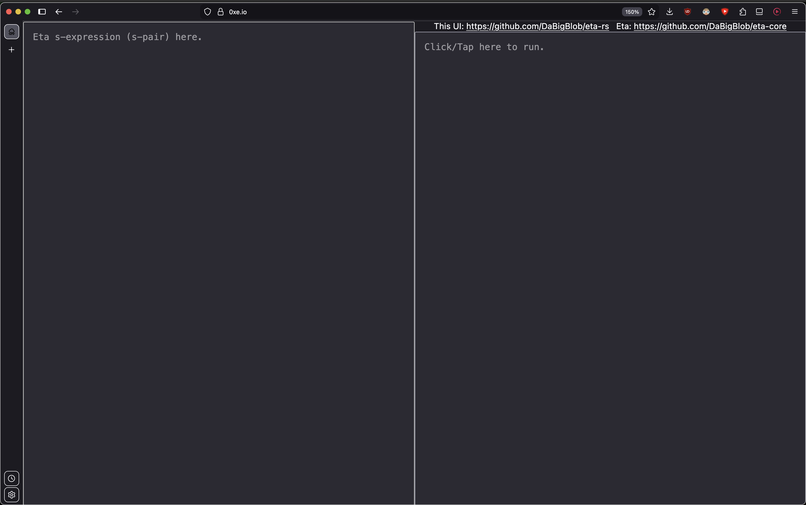

# Platform specific Human-Interfaces for Eta-Core
Run Eta everywhere.

# Browser (WASM)
### Use at https://0xe.io


### Build
```
cargo build -p wasm --target wasm32-unknown-unknown --release
```

### Deploy
```bash
make -C crates/wasm deploy # this auto builds first then deploys to cf workers
```

# CLI
### Use
```bash
cli S-PAIR # usually under target/release/cli after build (below)
```
> Note: --target may be specified for crosscompilation

### Build
```bash
cargo build -p cli --release
```

# Embedded devices
> Under heavy WIP.
